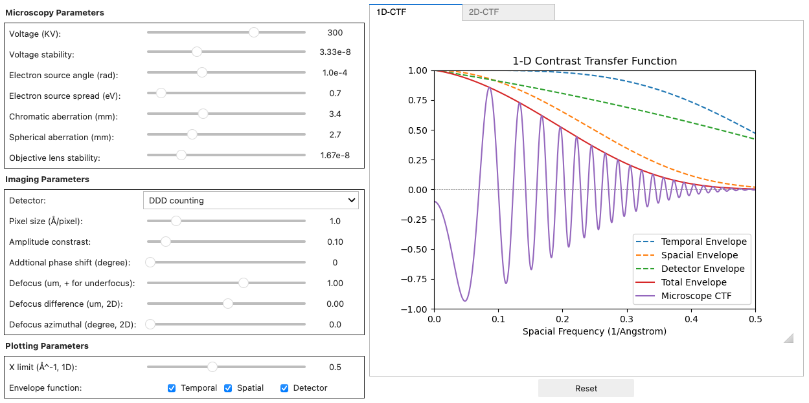

# CTF Simulation
This repository contains a Jupyter Notebook implementation of the Contrast Transfer Function (CTF) in electron microscopy. It features an interactive graphical user interface (GUI) that allows you to explore how various factors affect the CTF in both 1D and 2D. Through this interactive tool, you can investigate the influence of parameters such as defocus, aberrations, and envelope functions on the resulting CTF.

## Screenshots

## Binder

## Acknowledgements
- This project was initially assisted by UChicago undergraduates David Pan and Kyle Oleksiuk.
- For questions, comments, or bug reports, please email mlzhao@uchicago.edu.
